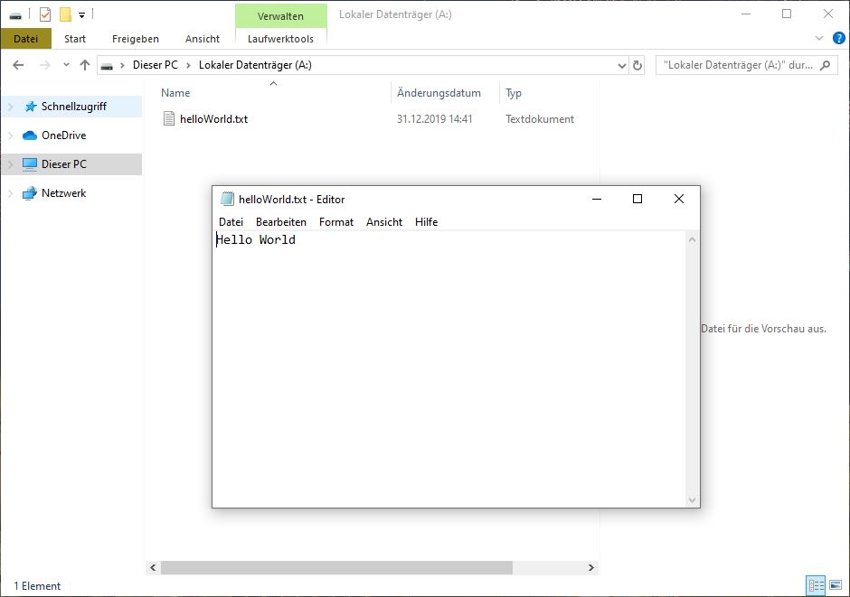

# Rust crypt compatible container (rust-ccc)

Rust crypt compatible container allows to create, read from and write to container files compatible to or created with TrueCrypt or VeraCrypt.

*__Note: Use this library at your own risk. The author of the library is in no way responsible for any consequential, incidental, indirect, or otherwise caused damages or losses.__
While some testing has been done to ensure the library is working as intended in the simplest of use cases no extensive testing to ensure proper behaviour in more complex situations has been performed. This is for educational purposes only and not ready for production use.*

## Usage
### Hello World - create new container, a file therein and write to it
```rust
fn main() {
    let file_system_size: usize = 512 * 512; // in bytes
    let container = ContainerFile::create(
        "foo/bar/container.vc",
        &"password",
    file_system_size
    )?;
        
    let fs = container.mount()?;
    let root_dir = fs.root_dir();
            
    let mut file = root_dir.create_file("helloWorld.txt")?;
    file.write_all(b"Hello World")?;
    file.flush()?;
}
```
### read from existing container
```rust
fn main() {
    let container = ContainerFile::open("foo/bar/container.vc")?;
    container.unlock("password")?;
        
    let fs = container.mount()?;
    let root_dir = fs.root_dir();
        
    let file = root_dir.open_file("helloWorld.txt")?;
    let buffered = BufReader::new(file);
    
    for line in buffered.lines() {
        println!("{}", line?);
    }
}
```
*sample file mounted with VeraCrypt:*


Both tasks above are included in the sample project in the `samples` folder.    

## Known limitations
* AES-256-XTS encryption cipher supported only
* FAT file system supported only

## Compilation notes
* on Windows the OpenSSL dependency (via `rust-openssl`) can be quite quite tricky to get working; testing was done with `Win64OpenSSL-1_1_0L` from https://slproweb.com/products/Win32OpenSSL.html
* make sure to add the OpenSSL folder to your environment variables: 
    * `PATH=%PATH%\;C:\OpenSSL-Win64\bin`
    * `OPENSSL_DIR=C:\OpenSSL-Win64`

## Sources
* [Official VeraCrypt file format specification](www.veracrypt.fr/en/VeraCrypt%20Volume%20Format%20Specification.html)
* [Python example of how to read TrueCrypt and VeraCrypt files](http://blog.bjrn.se/2008/01/truecrypt-explained.html)
